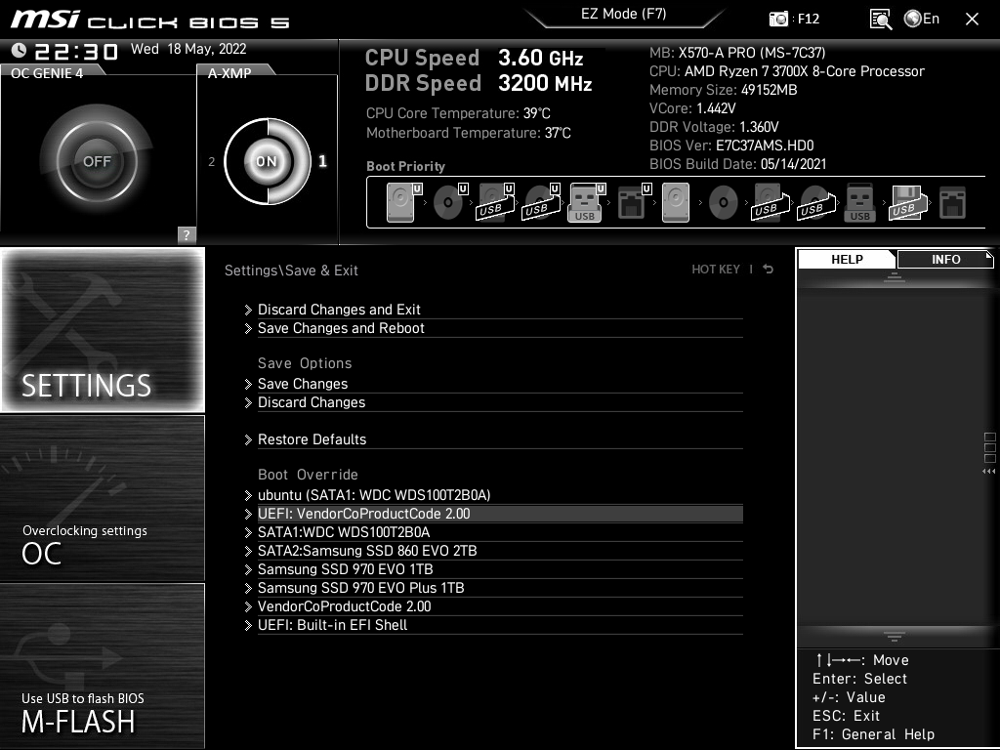

**Erasing data** from your computer may seem like a simple task, but if you want to make sure it is unrecoverable, there are some things you should consider.

!!! tip

    If your drive is encrypted, you do not need to worry about leaving traces of files on your computer, as your files are already impossible to access without the encryption key. If your drive is not encrypted, it is recommended to implement [full disk encryption](/encryption/#os-full-disk-encryption).

## Erasing Your Entire Drive

For an unencrypted drive, pressing ++del++ on a file isn't enough. This tells the filesystem to allow this space to be overwritten, but the data will still be recoverable. You don't know when the data will be overwritten, or even if it will at all. To ensure your files cannot be recovered, you will need to follow these steps:

!!! warning

    None of these methods are guaranteed to make your data completely unrecoverable. The best (and most fun) method is to grab a hammer or your favorite implement of destruction and smash it into pieces. Of course, make sure to be careful not injure yourself or anyone else.

For wiping all your drives, we recommend you use ShredOS. Install [Balena Etcher](https://www.balena.io/etcher/) and make sure you have a usb flash drive (it will be wiped, so make sure there aren't any important files on it). Download a [ShredOS](https://github.com/PartialVolume/shredos.x86_64#download-img-and-iso-files-for-burning-to-usb-flash-drives-and-cd-rdvd-r) .iso file and run Balena Etcher with your USB drive plugged in. Once you're done flashing the USB drive, restart your computer and enter your UEFI settings by pressing a key specified in your motherboard's manual, usually ++f2++, ++f12++, or ++del++. There should be a "Boot Override" option somewhere. Select your USB device from the menu and it will boot into ShredOS. Follow the onscreen prompts to wipe your data.

## Erasing Specific Files

Securely erasing **individual files** is futile. You should copy your files over to a new (hopefully encrypted) drive and use the above methods to erase your current drive. SSD's implement wear leveling to help extend the life of the drive, which will cause data to be written in multiple places on the drive, making it impossible to know if the file was truly erased. Even if you attempt to overwrite all free space, the actual available storage on the drive is usually more than what is exposed to you, so there will still be leftover data. There's also [SLC cache](https://www.atpinc.com/blog/what-is-SLC-cache-difference-between-Dynamic-Static-SLC-cache) which can be multiple gigabytes, meaning that the data won't be erased for multiple minutes.

--8<-- "includes/abbreviations.en.md"
